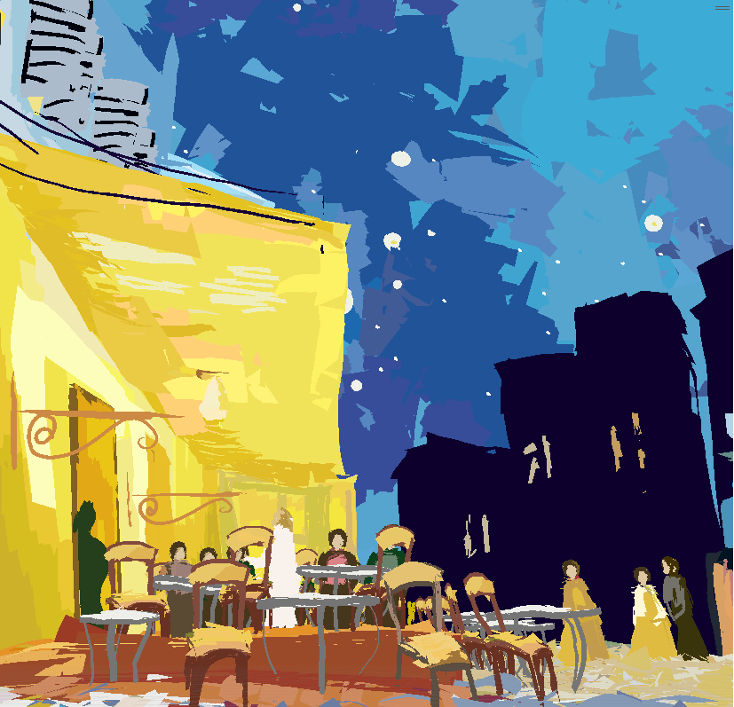
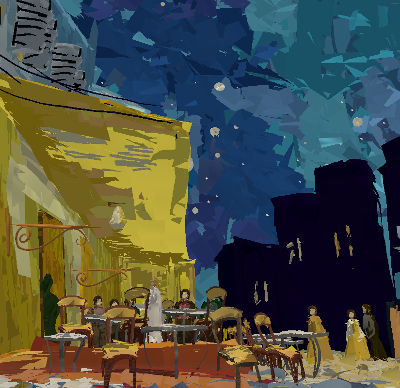
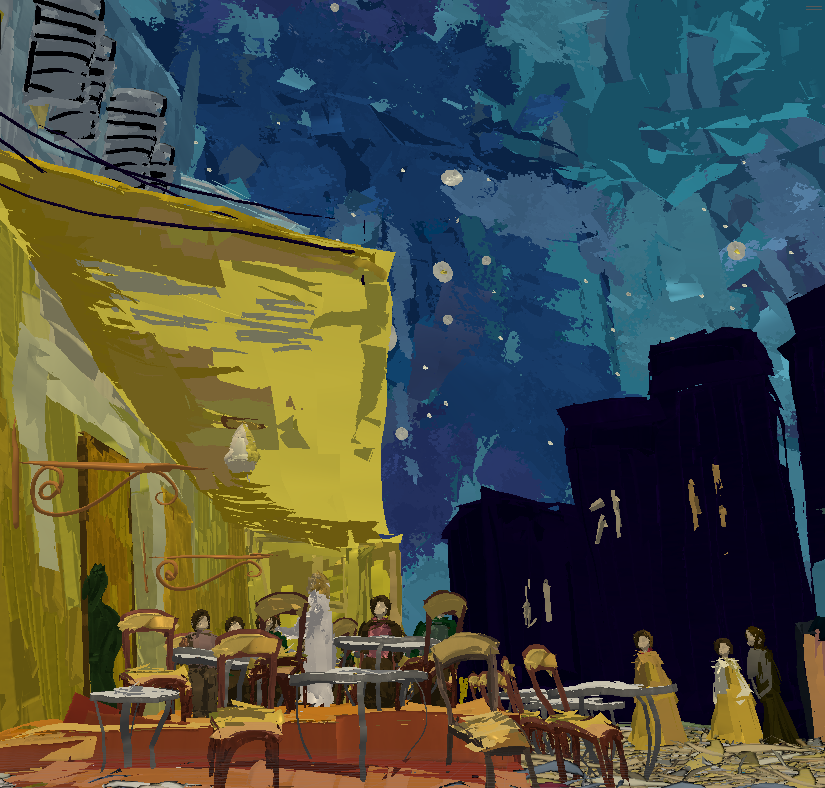

# 前置き
ポートフォリオとして利用しているリポジトリです。
そのため、一般的な利用はあまり想定しておりません。

# 概要
Unityで3Dモデルの頂点カラーを表示するシェーダーです。 
ライトの影響を受ける他、ノーマルマップによる凹凸表現、アルファマスクによるざらつきの設定ができます。  

blenderで頂点カラーにより着色されたモデルをUnityで使用する必要があったため、作成いたしました。

通常の頂点カラーシェーダーとして利用可能な他、白黒のマスク画像を設定することで、筆の柄のような模様をつけることが可能です。

# 利用可能設定
## 頂点カラーのみ
頂点カラーのみ表示する設定でのプレビューです。  
この機能だけを備えたシェーダーはよくあります。  

  

## 頂点カラー＋ライティングの影響あり
頂点カラーに加え、ライトの影響を受けるようにした状態でのプレビューです。  
ノーマルマップ用の画像を指定することで、凹凸も表現できます。  

## 頂点カラー＋ライティングの影響あり＋マスク画像によるざらつき指定
頂点カラー、ライトの影響に加えて、マスク画像による模様を指定した状態でのプレビューです。  
筆で塗ったようなざらつきを表現できます。  

Unity 2021.3.20f1で動作確認済み。  
[比較に利用したモデル](https://sketchfab.com/3d-models/van-gogh-d828cf07eacd4f14bb48576731ec7833)

# 仕様言語
HLSL